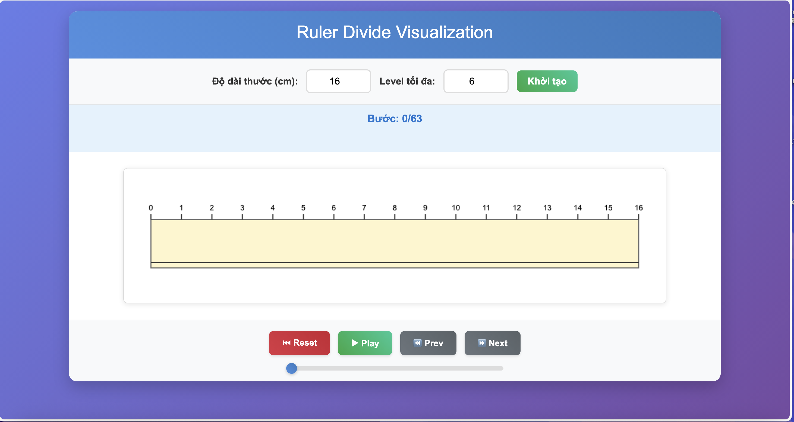

# 📷 Screenshot



# 📏 Ruler Divide Visualization

Ứng dụng mô phỏng quá trình chia thước kẻ bằng phương pháp đệ quy, được xây dựng bằng HTML, CSS và JavaScript

## ✨ Tính năng

- 🎯 **Mô phỏng trực quan**: Hiển thị từng bước chia thước một cách sinh động
- 📐 **Tùy chỉnh độ dài**: Cho phép nhập độ dài thước tùy ý (cm)
- ⏯️ **Điều khiển phát**: Play/Pause, Next/Previous, Reset
- 🎚️ **Slider điều hướng**: Nhảy đến bước bất kỳ
- ⌨️ **Phím tắt**: Mũi tên trái/phải, Space
- 📱 **Responsive**: Tự động thích ứng mọi kích thước màn hình
- 🎨 **Giao diện hiện đại**: Gradient, shadows, animations mượt mà

## 🚀 Cách sử dụng

### Clone dự án về máy
```bash
# Clone repository về máy
git clone https://github.com/yourusername/Ruler-Divide-Visualization.git

# Di chuyển vào thư mục dự án
cd Ruler-Divide-Visualization
```

### Chạy ứng dụng
1. Mở file `index.html` trong trình duyệt web
2. Hoặc double-click vào file `index.html`
3. Hoặc sử dụng Live Server (nếu có extension trong VS Code)

### Điều khiển
- **Nhập độ dài thước**: Thay đổi số trong ô input và click "Khởi tạo"
- **⏮ Reset**: Về bước đầu tiên
- **▶ Play / ⏸ Pause**: Tự động chạy/tạm dừng
- **⏪ Prev / ⏩ Next**: Điều hướng từng bước
- **Slider**: Kéo để nhảy đến bước bất kỳ
- **Phím tắt**:
  - `←` / `→`: Bước trước/sau
  - `Space`: Play/Pause

## 🛠️ Công nghệ sử dụng

- **HTML5**: Cấu trúc semantic, Canvas API
- **CSS3**: Grid/Flexbox, Gradients, Animations
- **JavaScript ES6+**: Classes, Arrow functions, Modules
- **Canvas 2D**: Vẽ thước và các vạch chia
- **RequestAnimationFrame**: Animation 60fps mượt mà

## 📁 Cấu trúc dự án

```
Ruler-Divide-Visualization/
├── index.html          # Giao diện chính
├── styles.css          # Styling và responsive
├── index.js            # Logic ứng dụng (class-based)
├── README.md           # Tài liệu này
└── assets/
    └── screenshot.png  # Ảnh chụp màn hình
```

## 🔧 Thuật toán

Ứng dụng sử dụng thuật toán đệ quy để chia thước:

1. **Bước đầu**: Chia đoạn [0, L] tại điểm giữa L/2
2. **Đệ quy**: Tiếp tục chia các đoạn con
3. **Điều kiện dừng**: Khi đoạn chia < 0.01cm hoặc độ cao vạch < 0.1cm
4. **Độ cao vạch**: Giảm dần 0.2cm mỗi lần chia